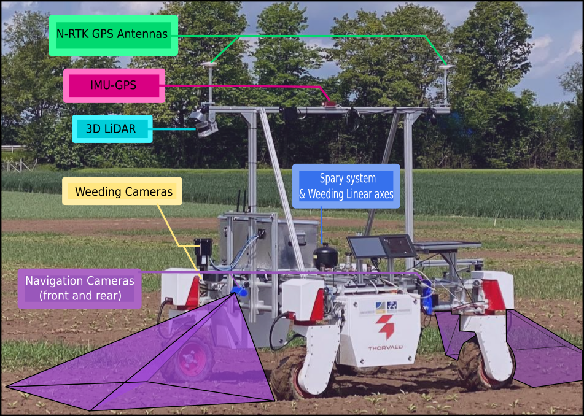

       
# Visual Multi Crop Row Navigation in Arable Farming Fields (ROS2)    

A work presented in IROS 2022 - Kyoto, Japan

<div align="center">
	
</div>

Check out the [video1](https://youtu.be/z2Cb2FFZ2aU?t=43), of our robot following this approach to navigate on a real multi lace row-crop field (beans field).
<div align="center">
	
[](https://www.youtube.com/watch?v=z2Cb2FFZ2aU)
	
</div>

### pyCUDA installation (untested on this version)

May have success adapting the below for https://developer.download.nvidia.com/compute/cuda/repos/ubuntu2204/x86_64/

	wget https://developer.download.nvidia.com/compute/cuda/repos/ubuntu1804/x86_64$
	sudo mv cuda-ubuntu1804.pin /etc/apt/preferences.d/cuda-repository-pin-600
	wget https://developer.download.nvidia.com/compute/cuda/10.2/Prod/local_install$
	sudo dpkg -i cuda-repo-ubuntu1804-10-2-local-10.2.89-440.33.01_1.0-1_amd64.deb
	sudo apt-key add /var/cuda-repo-10-2-local-10.2.89-440.33.01/7fa2af80.pub
	sudo apt-get update
	sudo apt-get -y install cuda

### Dependencies

- Ubuntu 22.04 & [ROS2 Humble](https://github.com/linorobot/ros2me)
- sudo apt-get install python3-shapely python3-opencv python3-pip ros-humble-usb-cam
- pip3 install future scipy 


Install tf2_geometry_msgs from source (because we need the `do_transform_pose` which is going 
to be merged in this [PR](https://github.com/ros2/geometry2/pull/533))

    cd my_ws/src/
    git clone https://github.com/ros2/geometry2.git
    cd geometry2
    git fetch origin pull/533/head:pr-533
    git checkout pr-533
    
### Install

    git clone --branch ROS2 https://github.com/Agroecology-Lab/visual-multi-crop-row-navigation.git
    
Check ROS dependencies
    
    rosdep install --from-paths src --ignore-src -r -y    

### Build and run

navigate to your colcon workspace folder, e.g.:
  
    cd my_ws/
    
clean:

    rm -rf build/ install/ log
    colcon build
    
source setup file:

    source ./install/setup.bash
    
    
launch main script:

    ros2 launch visual_multi_crop_row_navigation vs_navigation.launch.xml
 
Camera check & launch

     v4l2-ctl -d /dev/video0 --list-formats-ext
     sudo nano /opt/ros/humble/share/usb_cam/config/params.yaml
     ros2 launch usb_cam demo_launch.py
    
	    
## Multi-Crop Row Navigation Datasets

used for analyze the robustness of crop-row detection
technique as a quantitative evaluate. For each of the
five crops (sugar_beet, potato, beans, lemon-balm and coriander) and three
simulated fields, 100 images were annotated using data from
BonnBot-I where the camera tilt angle ρ was varied from 55◦
to 75◦. The annotations contain ground-truth of all the lines
located underneath the robot. 
To measure the accuracy we compare the predicted lines of each image to the ground-truth
using two parameters: position and orientation. The position
of a line is defined based on its intersection with bottom edge
of the image, where the distance between the prediction and
the ground truth is normalized based on the width of the
image.

<div align="center">
	
[](https://)
	
</div>

for accessing dataset please sned an email to: Alireza.ahmadi@uni-bonn.de 

Alternatively this may be useful: https://github.com/Hamza-MAILKA/Crop_Row_Dataset

## Citation 
if you use this project in your recent works please refernce to it by:

```bash

@article{ahmadi2021towards,
  title={Towards Autonomous Crop-Agnostic Visual Navigation in Arable Fields},
  author={Ahmadi, Alireza and Halstead, Michael and McCool, Chris},
  journal={arXiv preprint arXiv:2109.11936},
  year={2021}
}

@inproceedings{ahmadi2020visual,
  title={Visual servoing-based navigation for monitoring row-crop fields},
  author={Ahmadi, Alireza and Nardi, Lorenzo and Chebrolu, Nived and Stachniss, Cyrill},
  booktitle={2020 IEEE International Conference on Robotics and Automation (ICRA)},
  pages={4920--4926},
  year={2020},
  organization={IEEE}
}
```

## Acknowledgments
This work has been supported by the German Research Foundation under Germany’s Excellence Strategy, EXC-2070 - 390732324 ([PhenoRob](http://www.phenorob.de/)) and [Bonn AgRobotics Group](http://agrobotics.uni-bonn.de/)
The ROS2 port was done by Agroecology Lab CIC
